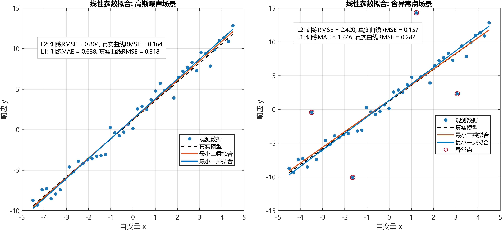
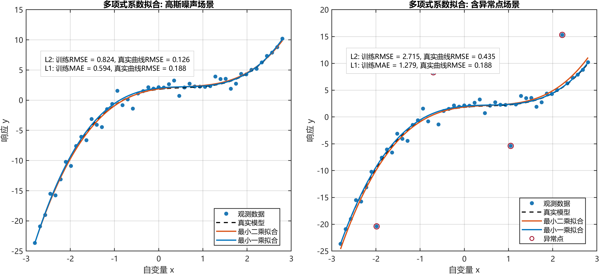
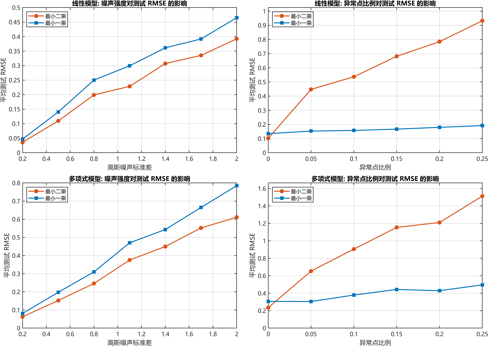
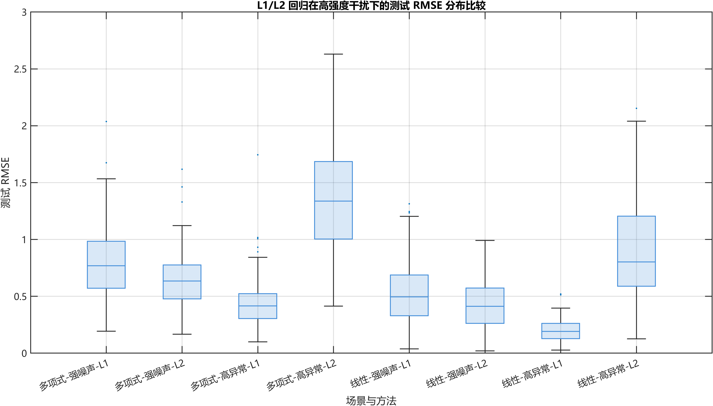

# 最小一乘回归与最小二乘回归的公式推导、数据分析与结果讨论

## 1. 最小一乘回归与最小二乘回归

设训练样本集为

$$
\mathcal{D}=\{(x_i,y_i)\}_{i=1}^{n}
$$

其中 $x_i \in \mathbb{R}^{d}$ 为输入，$y_i \in \mathbb{R}$ 为输出。将截距项并入参数向量后，可写成线性回归统一形式

$$
y_i=\phi(x_i)^{\mathrm{T}}\beta+\varepsilon_i,\quad i=1,2,\ldots,n
$$

其中 $\phi(x_i)$ 为基函数向量，$\beta$ 为待估参数，$\varepsilon_i$ 为残差。对线性拟合问题，有

$$
\phi(x_i)=
\begin{bmatrix}
1 \\
x_i
\end{bmatrix}
$$

对三次多项式拟合问题，有

$$
\phi(x_i)=
\begin{bmatrix}
x_i^3 \\
x_i^2 \\
x_i \\
1
\end{bmatrix}
$$

记设计矩阵为

$$
X=
\begin{bmatrix}
\phi(x_1)^{\mathrm{T}}\\
\phi(x_2)^{\mathrm{T}}\\
\vdots\\
\phi(x_n)^{\mathrm{T}}
\end{bmatrix},
\quad
y=
\begin{bmatrix}
y_1\\
y_2\\
\vdots\\
y_n
\end{bmatrix}
$$

则模型可写为

$$
y=X\beta+\varepsilon
$$

### 1.1 最小二乘回归

最小二乘回归以残差平方和最小为目标，即

$$
\begin{aligned}
\hat{\beta}_{L2}
&=
\arg\min_{\beta}\|y-X\beta\|_2^2 \\
&=
\arg\min_{\beta}\sum_{i=1}^{n}(y_i-\phi(x_i)^{\mathrm{T}}\beta)^2
\end{aligned}
$$

对上式求梯度并令其为零，可得正规方程

$$
\frac{\partial}{\partial \beta}\|y-X\beta\|_2^2=-2X^{\mathrm{T}}(y-X\beta)=0
$$

因此

$$
X^{\mathrm{T}}X\hat{\beta}_{L2}=X^{\mathrm{T}}y
$$

当 $X^{\mathrm{T}}X$ 可逆时，有闭式解

$$
\hat{\beta}_{L2}=(X^{\mathrm{T}}X)^{-1}X^{\mathrm{T}}y
$$

式中可见，最小二乘回归对大残差采用平方惩罚，因此当样本噪声近似服从高斯分布时，L2 具有较高统计效率；但若存在离群点，则大残差会被放大，进而显著改变参数估计。

### 1.2 最小一乘回归

最小一乘回归以残差绝对值和最小为目标，即

$$
\begin{aligned}
\hat{\beta}_{L1}
&=
\arg\min_{\beta}\|y-X\beta\|_1 \\
&=
\arg\min_{\beta}\sum_{i=1}^{n}|y_i-\phi(x_i)^{\mathrm{T}}\beta|
\end{aligned}
$$

由于绝对值项在零点不可导，通常引入辅助变量 $u_i \ge 0$，将其转化为线性规划问题：

$$
\min_{\beta,u}\sum_{i=1}^{n}u_i
$$

约束条件为

$$
y_i-\phi(x_i)^{\mathrm{T}}\beta \le u_i,\quad i=1,2,\ldots,n
$$

$$
-(y_i-\phi(x_i)^{\mathrm{T}}\beta) \le u_i,\quad i=1,2,\ldots,n
$$

$$
u_i \ge 0,\quad i=1,2,\ldots,n
$$

将上述约束合并后，可写成标准形式

$$
\min_{z} f^{\mathrm{T}}z,
\quad
\text{s.t.}\ Az \le b,\ z \in \mathbb{R}^{p+n}
$$

其中 $z=[\beta^{\mathrm{T}},u^{\mathrm{T}}]^{\mathrm{T}}$。与 L2 不同，L1 只按线性方式惩罚大残差，因此对少量强离群样本更不敏感。

### 1.3 评价指标

为系统分析两种方法的性能，本文采用以下评价指标。

训练集均方根误差定义为

$$
\operatorname{RMSE}_{\text{train}}=\sqrt{\frac{1}{n}\sum_{i=1}^{n}(y_i-\hat{y}_i)^2}
$$

训练集平均绝对误差定义为

$$
\operatorname{MAE}_{\text{train}}=\frac{1}{n}\sum_{i=1}^{n}|y_i-\hat{y}_i|
$$

其中 $\hat{y}_i=\phi(x_i)^{\mathrm{T}}\hat{\beta}$。为了衡量拟合曲线相对真实模型的偏差，在稠密测试网格 $\{x_j^\ast\}_{j=1}^{m}$ 上定义真实曲线误差

$$
\operatorname{RMSE}_{\text{curve}}=\sqrt{\frac{1}{m}\sum_{j=1}^{m}\big(\hat{y}(x_j^\ast)-y_{\text{true}}(x_j^\ast)\big)^2}
$$

此外，参数估计误差定义为

$$
E_{\beta}=\|\hat{\beta}-\beta_{\text{true}}\|_2
$$

在鲁棒性扫描实验中，为比较两种方法在同一干扰强度下的性能改善幅度，定义相对改进率

$$
I=\frac{\operatorname{RMSE}_{L2}-\operatorname{RMSE}_{L1}}{\operatorname{RMSE}_{L2}}\times 100\%
$$

若 $I>0$，则说明 L1 在该场景下优于 L2；反之则 L2 更优。

上述核心指标的含义说明如下：

- 参数误差 $E_{\beta}$：衡量估计参数 $\hat{\beta}$ 与真实参数 $\beta_{\text{true}}$ 的欧氏距离，反映参数层面的估计偏差；数值越小表示参数恢复越准确。
- 训练 RMSE：衡量模型在训练样本上的二次误差平均水平，对大残差更敏感；数值越小表示训练拟合整体更紧密。
- 训练 MAE：衡量模型在训练样本上的绝对误差平均水平，相较 RMSE 对极端误差不那么敏感；数值越小表示典型样本误差更小。
- 真实曲线 RMSE：在稠密测试网格上比较估计曲线与真实生成曲线的均方根误差，反映模型在函数层面的泛化偏差；数值越小表示重建真实规律的能力越强。

表0汇总了本文使用过的全部指标。

| 指标名称 | 数学符号 | 定义/计算方式 | 使用位置 | 解释要点 |
| --- | --- | --- | --- | --- |
| 参数误差 | $E_{\beta}$ | $\|\hat{\beta}-\beta_{\text{true}}\|_2$ | 1.3节、表1 | 参数估计准确性 |
| 训练 RMSE | $\operatorname{RMSE}_{\text{train}}$ | $\sqrt{\frac{1}{n}\sum_{i=1}^{n}(y_i-\hat{y}_i)^2}$ | 1.3节、表1 | 对大残差敏感的训练误差 |
| 训练 MAE | $\operatorname{MAE}_{\text{train}}$ | $\frac{1}{n}\sum_{i=1}^{n}\lvert y_i-\hat{y}_i\rvert$ | 1.3节、表1 | 更稳健的训练平均绝对误差 |
| 真实曲线 RMSE | $\operatorname{RMSE}_{\text{curve}}$ | $\sqrt{\frac{1}{m}\sum_{j=1}^{m}(\hat{y}(x_j^\ast)-y_{\text{true}}(x_j^\ast))^2}$ | 1.3节、表1 | 函数级泛化偏差 |
| 相对改进率 | $I$ | $\frac{\operatorname{RMSE}_{L2}-\operatorname{RMSE}_{L1}}{\operatorname{RMSE}_{L2}}\times 100\%$ | 1.3节、3.2节 | 比较 L1 相对 L2 的收益 |
| 均值 | $\mu$ | $\frac{1}{N}\sum_{k=1}^{N}z_k$ | 表2、表3 | 中心趋势 |
| 标准差 | $\sigma$ | $\sqrt{\frac{1}{N}\sum_{k=1}^{N}(z_k-\mu)^2}$ | 表2、表3 | 波动性/稳定性 |
| 最小值 | $\min(z)$ | $\min_k z_k$ | 表2、表3 | 最优（最小误差）边界 |
| 最大值 | $\max(z)$ | $\max_k z_k$ | 表2、表3 | 最差（最大误差）边界 |
| 第一四分位数 | $Q_1$ | 样本 25% 分位数 | 表3 | 低误差区间下界 |
| 中位数 | $Q_2$ | 样本 50% 分位数 | 表3 | 分布中枢 |
| 第三四分位数 | $Q_3$ | 样本 75% 分位数 | 表3 | 高误差区间上界 |
| 样本数 | $N$ | 统计样本总数 | 表2、表3 | 统计可靠性基础 |

## 2. 数据分析方法

本文采用两组实验设计。

第一组为单次拟合实验，分别构造线性参数拟合与三次多项式系数拟合两类任务，并在固定随机种子下考察高斯噪声场景与异常点场景。该组实验用于观察拟合曲线形态、离群点牵引效应及单次误差指标。

第二组为 Monte Carlo 参数扫描实验。噪声强度扫描采用 $\sigma \in \{0.2,0.5,\ldots,2.0\}$，异常点比例扫描采用 $\rho \in \{0,0.05,\ldots,0.25\}$。每个参数点重复计算多次，并统计平均测试 RMSE 的均值、标准差、最小值、最大值及样本数，用于识别趋势和波动性。

为补充均值分析，本文进一步在强干扰条件下绘制箱型图。强噪声条件取 $\sigma=2.0$，高异常比例条件取 $\rho=0.25$，每一场景下采样 $120$ 次测试 RMSE，用于展示分布形态、中位数、四分位间距和极端值。

## 3. 结果

### 3.1 单次拟合结果

图1. 线性参数拟合结果。左图对应高斯噪声场景，右图对应异常点场景；散点为观测样本，虚线为真实模型，实线分别为 L2 与 L1 的拟合结果。

图1表明，在线性模型的高斯噪声场景中，L2 拟合曲线更贴近真实模型。由表1可见，L2 的真实曲线 RMSE 为 `0.163880`，低于 L1 的 `0.317575`。在右侧异常点场景中，L2 曲线被少量极端样本拉偏，而 L1 曲线仍保持对主体样本群的贴合；此时 L1 的真实曲线 RMSE 为 `0.107821`，优于 L2 的 `0.161820`。

图2. 三次多项式系数拟合结果。左图为高斯噪声场景，右图为异常点场景。

图2显示，在多项式模型中，模型阶数提高后系数扰动会被非线性项放大，因此异常点影响更易扩散到整条曲线。高斯噪声场景下，L2 的真实曲线 RMSE 为 `0.067757`，低于 L1 的 `0.233863`。异常点场景下，L2 的真实曲线 RMSE 上升至 `0.540669`，而 L1 为 `0.286565`，说明在高阶模型中，L1 对局部极端样本的抑制作用更加突出。

表1汇总了单次实验的主要指标。

| 场景 | 方法 | 参数误差 $E_{\beta}$ | 训练 RMSE | 训练 MAE | 真实曲线 RMSE | 结论 |
| --- | --- | ---: | ---: | ---: | ---: | --- |
| 线性-高斯噪声 | L2 | 0.103240 | 0.804184 | 0.663231 | 0.163880 | L2 最优 |
| 线性-高斯噪声 | L1 | 0.180727 | 0.819546 | 0.638140 | 0.317575 | 绝对误差较小，但曲线偏差更大 |
| 线性-异常点 | L2 | 0.081647 | 2.182597 | 1.102348 | 0.161820 | 对离群点敏感 |
| 线性-异常点 | L1 | 0.106001 | 2.187142 | 1.077503 | 0.107821 | 泛化更优 |
| 多项式-高斯噪声 | L2 | 0.102325 | 0.687574 | 0.542074 | 0.067757 | L2 最优 |
| 多项式-高斯噪声 | L1 | 0.308028 | 0.713297 | 0.527930 | 0.233863 | 曲线偏差偏大 |
| 多项式-异常点 | L2 | 0.409906 | 2.568326 | 1.307426 | 0.540669 | 退化明显 |
| 多项式-异常点 | L1 | 0.337125 | 2.601739 | 1.248254 | 0.286565 | 鲁棒性更强 |

### 3.2 参数扫描结果

图3. Monte Carlo 参数扫描结果。上排为线性模型，下排为多项式模型；左列为噪声强度扫描，右列为异常点比例扫描。

图3左列表明，在 $\sigma$ 从 `0.2` 增长到 `2.0` 的过程中，L1 与 L2 的测试 RMSE 均单调上升，但 L2 曲线始终位于 L1 下方。图3右列表明，当异常点比例 $\rho$ 提高时，L2 的误差增长速度远快于 L1，说明二次惩罚对离群点更敏感，而 L1 的线性惩罚能更好地保持估计稳定性。

表2给出了参数扫描实验的统计量。

| 扫描场景 | 方法 | 均值 | 标准差 | 最小值 | 最大值 | 样本数 $N$ |
| --- | --- | ---: | ---: | ---: | ---: | ---: |
| 线性-噪声扫描 | L2 | 0.233268 | 0.134006 | 0.037416 | 0.409240 | 7 |
| 线性-噪声扫描 | L1 | 0.276006 | 0.145575 | 0.049790 | 0.462957 | 7 |
| 线性-异常点扫描 | L2 | 0.603180 | 0.305718 | 0.104837 | 0.941511 | 6 |
| 线性-异常点扫描 | L1 | 0.168969 | 0.030812 | 0.133662 | 0.213358 | 6 |
| 多项式-噪声扫描 | L2 | 0.348202 | 0.201270 | 0.061911 | 0.612401 | 7 |
| 多项式-噪声扫描 | L1 | 0.432325 | 0.238668 | 0.079629 | 0.707155 | 7 |
| 多项式-异常点扫描 | L2 | 0.924681 | 0.432108 | 0.228617 | 1.402512 | 6 |
| 多项式-异常点扫描 | L1 | 0.365293 | 0.063417 | 0.301356 | 0.443406 | 6 |

在线性异常点扫描中，L1 相比 L2 的平均 RMSE 改进率达到 `71.99%`；在多项式异常点扫描中，该改进率为 `60.50%`。与此同时，L1 的标准差分别较 L2 降低 `89.92%` 与 `85.32%`。相反，在噪声扫描中，L2 分别较 L1 改善 `15.48%` 和 `19.46%`。

### 3.3 分布特征结果

图4. 强干扰条件下测试 RMSE 的箱型图。强噪声条件取 $\sigma=2.0$，高异常比例条件取 $\rho=0.25$，每组样本数均为 `120`。

箱型图进一步揭示了均值之外的分布特征。在线性强噪声场景下，L2 的 RMSE 均值为 `0.424974`，中位数为 `0.412864`，均低于 L1 的 `0.522716` 和 `0.494630`；多项式强噪声场景下，L2 的均值与中位数也低于 L1。

在高异常比例场景下，差异进一步扩大。线性高异常条件下，L2 的均值为 `0.889503`，四分位区间约为 `[0.588597, 1.204782]`，而 L1 的均值仅为 `0.197477`，四分位区间为 `[0.127264, 0.262183]`；多项式高异常条件下，L2 的均值达到 `1.368859`，显著高于 L1 的 `0.440498`。

表3汇总了图4对应的分布统计量。

| 场景 | 方法 | 均值 | 标准差 | Q1 | 中位数 | Q3 | 最大值 | $N$ |
| --- | --- | ---: | ---: | ---: | ---: | ---: | ---: | ---: |
| 线性-强噪声 | L2 | 0.424974 | 0.219409 | 0.262105 | 0.412864 | 0.572972 | 0.990637 | 120 |
| 线性-强噪声 | L1 | 0.522716 | 0.268745 | 0.329284 | 0.494630 | 0.688032 | 1.313554 | 120 |
| 线性-高异常 | L2 | 0.889503 | 0.436087 | 0.588597 | 0.802877 | 1.204782 | 2.153261 | 120 |
| 线性-高异常 | L1 | 0.197477 | 0.100836 | 0.127264 | 0.191557 | 0.262183 | 0.520564 | 120 |
| 多项式-强噪声 | L2 | 0.647854 | 0.254339 | 0.478231 | 0.635464 | 0.776196 | 1.617704 | 120 |
| 多项式-强噪声 | L1 | 0.789521 | 0.316295 | 0.570763 | 0.769660 | 0.984622 | 2.037204 | 120 |
| 多项式-高异常 | L2 | 1.368859 | 0.505678 | 1.004586 | 1.338076 | 1.686013 | 2.630079 | 120 |
| 多项式-高异常 | L1 | 0.440498 | 0.216449 | 0.305340 | 0.416178 | 0.523264 | 1.744634 | 120 |

## 4. 讨论

从理论上看，L2 通过平方损失对大残差施加二次惩罚；当误差来源于高斯扰动时，L2 能更充分利用样本信息，因此在纯噪声场景表现更优。相反，当样本中掺入少量大偏差时，平方项会放大异常点影响，使参数更易偏移。

L1 通过绝对损失进行线性惩罚，因此对异常点具有天然抑制作用。图3右列和图4均验证了这一点：当异常点比例提高时，L2 的误差分布明显上移并拉宽，而 L1 仍保持较低中位数与较窄四分位距。

比较线性模型与三次多项式模型可发现，异常点对高阶模型的破坏更强。多项式异常点场景下，L2 的均值和最坏值增长更快，说明当基函数维度提高时，局部扰动更容易传播为全局曲线形变。

## 5. 结论

本文从公式推导出发，系统比较了 L1 回归与 L2 回归在线性模型和三次多项式模型中的性能。结果表明：

1. 当误差主要表现为高斯噪声时，L2 具有更高精度，噪声扫描中平均测试 RMSE 分别较 L1 低 `15.48%` 和 `19.46%`。
2. 当样本中存在异常点时，L1 展现出更强鲁棒性，在线性和多项式异常点扫描中平均 RMSE 分别较 L2 降低 `71.99%` 和 `60.50%`。
3. 箱型图结果说明，L1 的优势不仅体现在均值改善，也体现在中位数降低、四分位距收缩以及极端值风险受控。
4. 因此，L2 更适用于误差分布平稳、接近高斯的常规拟合任务；L1 更适用于存在稀疏大偏差、离群点或重尾噪声的数据环境。
