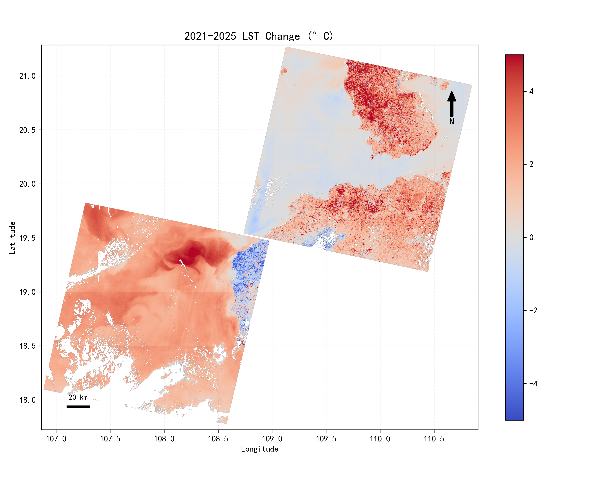
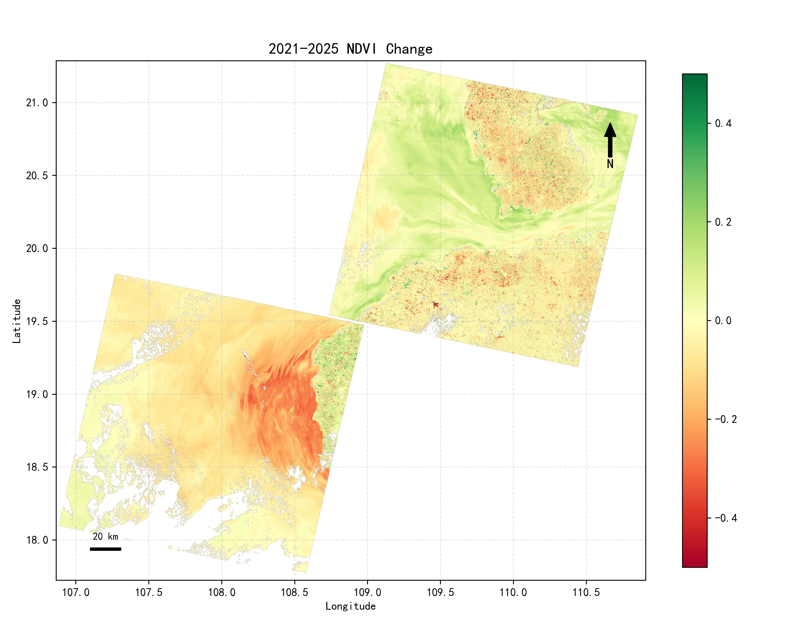
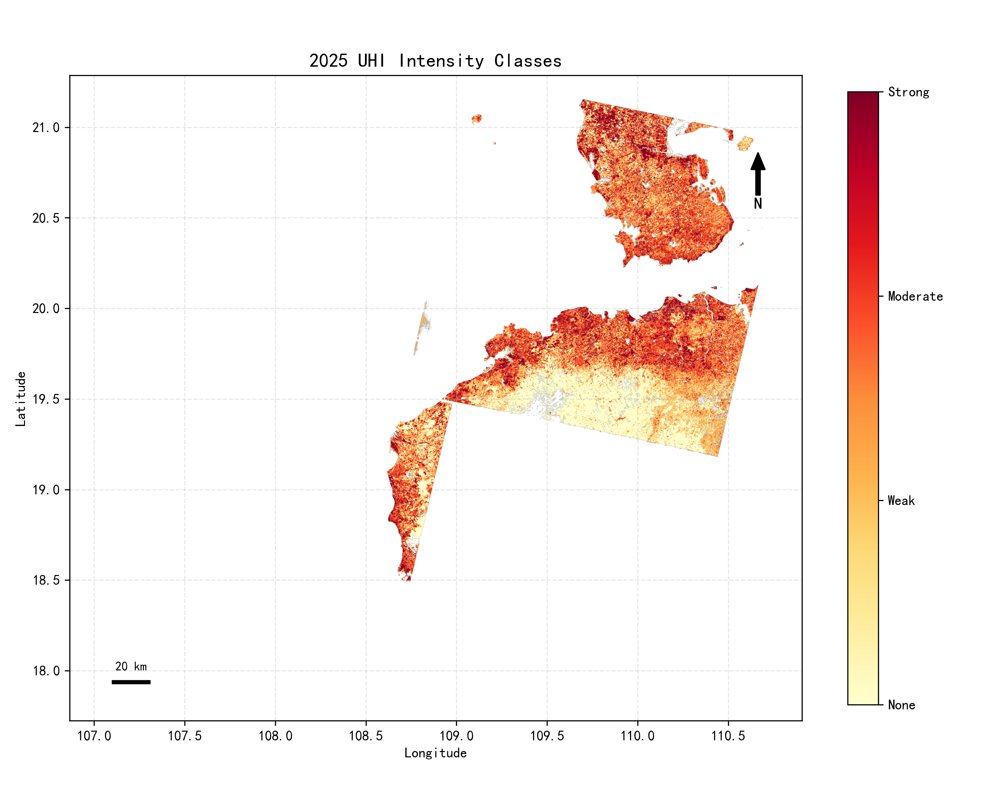
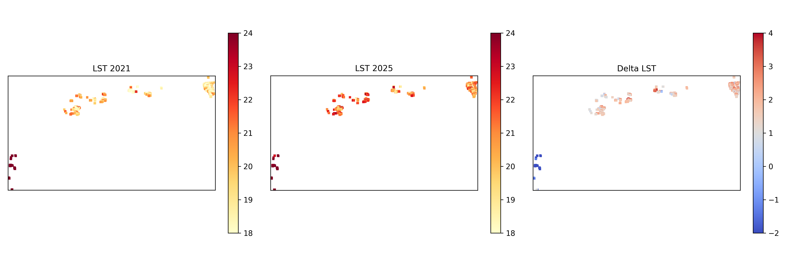
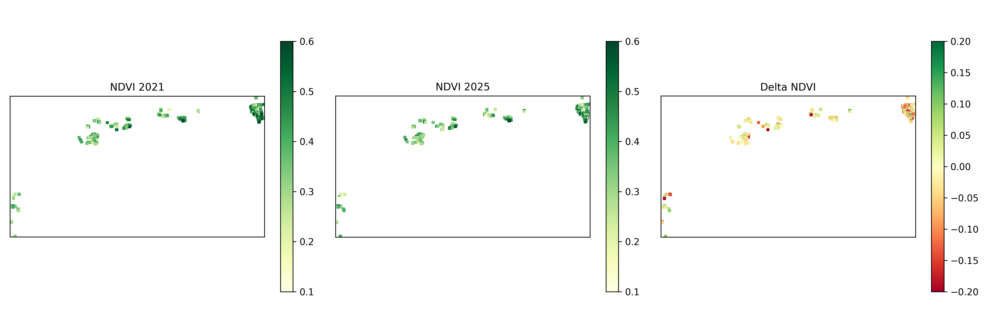
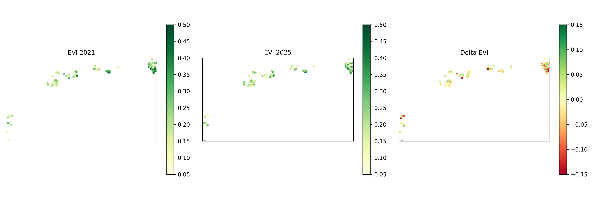
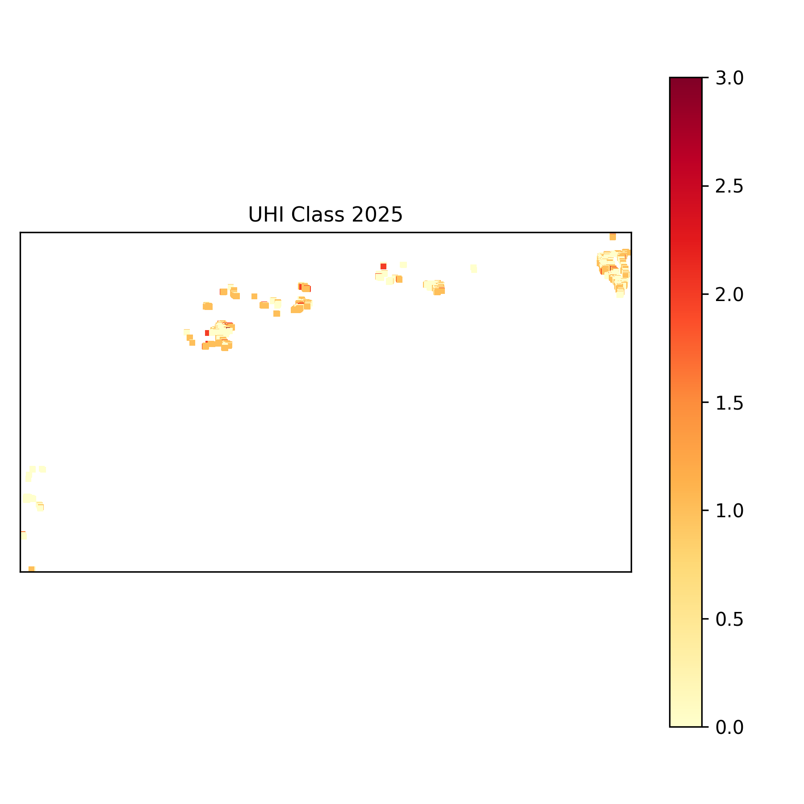
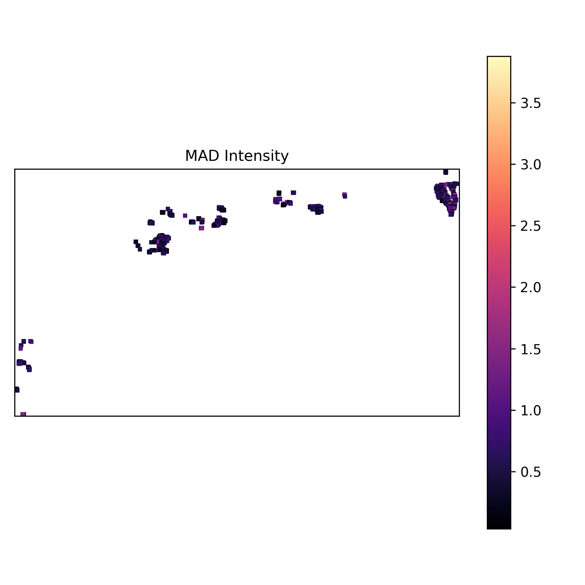
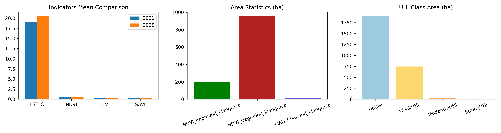

# 海南岛红树林生态系统遥感监测研究报告

## 摘要

海南岛红树林生态系统是热带海岸带重要的生态屏障，也是近岸热环境调节、岸线稳定和生物多样性维持的关键空间单元。本文基于 Global Mangrove Watch（全球红树林观察）发布的红树林分布数据作为掩膜边界，采用 Landsat 8 Collection 2 Level-2 Science Product 遥感数据，对 2021 年与 2025 年冬季开展地表温度、植被指数和热岛强度综合监测，并以海南岛西部与北部沿岸 Landsat 公共覆盖区的镶嵌结果作为区域背景，对掩膜约束后的红树林区域进行专项对比分析。研究表明，西部与北部沿岸公共覆盖区 2021-2025 年平均地表温度由 20.75°C 升至 22.18°C，平均升温 1.44°C，NDVI 平均变化为 -0.0260，强热岛面积占分析区 3.70%；红树林区域内有效分析面积为 2670.93 ha，LST 均值由 19.04°C 升至 20.51°C，平均增温 1.46°C，NDVI 由 0.5110 降至 0.4783，显著升温面积占比达 95.70%，而强热岛面积仅占 0.15%。结果说明，海南岛红树林在研究期内表现出整体升温和植被减弱并行的生态响应，同时保留了一定的热缓冲能力，但局地异常扰动斑块已出现，需在后续保护与修复中重点关注。

**关键词**：海南岛；红树林；Landsat 8；NDVI；LST；UHI；不确定性评估

## 1. 引言

红树林生态系统广泛分布于热带和亚热带潮间带，是陆海交互区最具代表性的高生产力生态系统之一。其在防风消浪、沉积物固定、蓝碳储存、生境维持和岸线稳定方面具有不可替代的生态功能，因此也是海岸带生态安全格局中的核心组成部分。<sup>[1][2]</sup>对于海南岛而言，红树林不仅承担海岸防护和生态调节任务，还直接关系到河口、海湾、潟湖与潮滩等敏感地貌单元的长期稳定。

近年来，沿海开发活动、局地热环境增强、土地利用转换和自然扰动叠加作用，使红树林生态系统面临热胁迫增强、植被活力下降和空间破碎化加剧等风险。<sup>[2]</sup>

本文首先在海南岛西部与北部沿岸的Landsat公共覆盖区概括地表温度、植被指数和热岛格局的总体变化，再利用红树林掩膜提取目标区域，量化其生态响应强度、空间异质性、显著性特征与不确定性来源。

## 2. 研究区概况

### 2.1 空间范围

研究对象为海南岛红树林生态系统，分析边界采用统一红树林掩膜矢量约束。该研究区主要分布于海南岛近岸潮间带及河口湾岸地带，空间形态呈现斑块状、带状和湾岸型组合特征。

### 2.2 自然地理背景

海南岛位于中国热带海洋气候区，全年高温多雨，海岸线漫长，河口、海湾、潟湖和潮滩分布广泛，为红树林的萌生、生长与扩展提供了适宜的热量和水文条件。岛内地貌与岸线类型差异显著，不同岸段在沉积环境、潮汐动力和周边地表覆盖结构上具有明显差别，决定了红树林生态系统在不同海岸单元中表现出较强的空间异质性。<sup>[2]</sup>

### 2.3 生态敏感性与监测需求

红树林对地表温度、土壤与沉积物水盐条件、岸线形态变化以及周边建设活动极为敏感。若局地热环境持续升高，或邻近地表类型发生快速变化，则可能引发植被活力下降、生境质量降低和群落稳定性减弱。基于此，海南岛红树林更适合采用多指标协同、同季节对比和掩膜约束统计的遥感方法进行周期性监测。<sup>[1][2]</sup>

## 3. 数据与分析方法

### 3.1 数据源与时间范围

表 1 汇总了本文使用的数据源、空间分辨率及其分析用途。研究期选择 2021 年与 2025 年冬季时相，目的在于降低季节差异对跨期比较的干扰，并保证太阳高度角和植被物候背景具有较高可比性。

| 数据类型 | 数据来源 | 空间分辨率 | 时间范围 | 主要用途 |
|:---|:---|---:|:---|:---|
| Landsat 8 Collection 2 Level-2 Science Product | USGS | 30 m | 2021 年 1 月、2025 年 1 月 | 反演 LST、NDVI、EVI、SAVI、UHI 与 MAD |
| 红树林掩膜矢量 | Global Mangrove Watch 体系成果整理后的研究区边界 | 矢量边界 | 2020 年版本边界，分析中作为静态约束 | 统一限定研究对象并提取红树林像元 |

注：Landsat 影像以同季节双时相进行对比，栅格分析统一到 30 m 空间分辨率；温度单位为 °C，面积单位为 ha。

### 3.2 预处理流程

本文采用 USGS Collection 2 Level-2 产品的标准缩放系数与质量控制波段进行预处理，流程包括元数据解析、质量掩膜构建、尺度变换、重投影配准、公共区域提取和掩膜内复核六个步骤。<sup>[5]</sup>

依据元数据文件读取影像获取日期、太阳高度角、太阳方位角和比例系数；依据 `QA_PIXEL` 与 `QA_RADSAT` 剔除云、云影、卷云、雪和辐射饱和像元，以保证后续反演仅建立在高质量观测上；将地表反射率和地表温度数字量值转换为物理量。对于表面反射率，采用 USGS 推荐的缩放表达式

$$
\rho = DN \times 0.0000275 - 0.2
$$

其中，$\rho$ 为地表反射率，$DN$ 为对应波段的数字量值。对于地表温度产品，采用

$$
T_{K} = DN \times 0.00341802 + 149.0
$$

$$
T_{C} = T_{K} - 273.15
$$

其中，$T_{K}$ 为开尔文温度，$T_{C}$ 为摄氏温度。随后，以 2021 年影像为参考，对 2025 年影像执行重投影、双线性重采样和子像元级平移校正，并仅保留两期完全重叠且通过质量控制的公共像元。最后，对镶嵌后的结果执行红树林掩膜裁切与二次汇总复核，使研究区统计严格限定于红树林空间边界之内。<sup>[5]</sup>

红树林提取在本文中采用既有红树林边界对遥感结果实施几何约束。设红树林空间域为 $\Omega_{m}$，任一像元中心坐标为 $(x, y)$，则二值掩膜可定义为

$$
M(x, y) =
\begin{cases}
1, & (x, y) \in \Omega_{m} \\
0, & (x, y) \notin \Omega_{m}
\end{cases}
$$

对于任一栅格变量 $X(x, y)$，掩膜后的红树林专属变量表示为

$$
X_{m}(x, y) =
\begin{cases}
X(x, y), & M(x, y)=1 \\
\mathrm{NaN}, & M(x, y)=0
\end{cases}
$$

在此基础上，红树林区域均值和面积分别表示为

$$
\bar{X}_{m} = \frac{1}{n} \sum_{i=1}^{n} X_{m,i}
$$

$$
A_{m} = n \times a_{p}
$$

其中，$n$ 为掩膜内有效像元数，$a_{p}$ 为单像元面积。由于栅格分辨率统一为 30 m，因此名义像元面积约为 $900\ \text{m}^{2}$，统计结果最终换算为公顷。

由此构建的统计单元，为后续专项对比分析提供了稳定边界。

### 3.4 遥感指数与变化指标反演方法

本文以 NDVI、LST 和 UHI 为核心指标，并使用 EVI、SAVI 与 MAD 作为辅助指标，从植被活力、热环境和综合变化三个维度刻画生态响应。

归一化植被指数采用国际通用公式

$$
NDVI = \frac{\rho_{NIR} - \rho_{Red}}{\rho_{NIR} + \rho_{Red}}
$$

其中，$\rho_{NIR}$ 为近红外波段反射率，$\rho_{Red}$ 为红光波段反射率。NDVI 值越大，通常表示冠层活力和光合活动越强。

为降低高覆盖植被饱和效应并考察土壤背景影响，本文同步计算 EVI 和 SAVI：

$$
EVI = G \times \frac{\rho_{NIR} - \rho_{Red}}{\rho_{NIR} + C_{1}\rho_{Red} - C_{2}\rho_{Blue} + L}
$$

$$
SAVI = \frac{(1 + L)(\rho_{NIR} - \rho_{Red})}{\rho_{NIR} + \rho_{Red} + L}
$$

其中，$G=2.5$，$C_{1}=6$，$C_{2}=7.5$，$L=1$ 为 EVI 的标准参数；SAVI 中土壤调节因子取 $L=0.5$。EVI 适于表达高覆盖植被差异，SAVI 适于削弱裸地背景干扰。<sup>[3]</sup>

地表温度采用 USGS Level-2 产品提供的标准地表温度波段直接换算，避免重复进行单窗算法中的大气校正和地表比辐射率估计。温度变化表示为

$$
\Delta LST = LST_{2025} - LST_{2021}
$$

当地表温度升高时，$\Delta LST > 0$；反之则表示降温。该指标直接反映红树林受热环境影响的方向和幅度。

城市热岛强度以研究区域内农村背景温度均值作为基准，定义为

$$
UHI_{i} = LST_{i} - \overline{LST}_{rural}
$$

其中，$UHI_{i}$ 为第 $i$ 个像元的热岛强度，$\overline{LST}_{rural}$ 为农村背景区平均地表温度。依据通行阈值，本文将其划分为无热岛（$UHI \leq 0$）、弱热岛（$0 < UHI \leq 2$）、中等热岛（$2 < UHI \leq 4$）和强热岛（$UHI > 4$）四级。<sup>[4]</sup>

为增强对多波段联合异常变化的识别能力，本文进一步采用多元变化检测（MAD）方法。MAD 基于两期多光谱特征的典型相关分析构建差异分量，并以标准差阈值提取异常变化像元。本文将 $|MAD| > 2\sigma$ 的像元定义为高变化区，用于识别局地综合扰动斑块。综上，多指标组合能够从热环境、植被状态和复合扰动三个角度构成较完整的监测证据链。<sup>[6]</sup>

### 3.5 显著性检验与不确定性评估

为了区分随机波动与真实变化，本文对两期 LST 采用局部 Welch 型 $t$ 检验。在 $5 \times 5$ 邻域窗口内，检验统计量表示为

$$
t = \frac{\bar{x}_{2025} - \bar{x}_{2021}}{\sqrt{\frac{s_{2025}^{2}}{n_{2025}} + \frac{s_{2021}^{2}}{n_{2021}}}}
$$

其中，$\bar{x}$ 为局部均值，$s^{2}$ 为局部方差，$n$ 为参与计算的有效像元数。当 $p < 0.05$ 时，将温度变化判定为显著升温或显著降温。对于 NDVI、EVI 和 SAVI，本文采用均值变化、标准差和改善/退化面积共同评估响应强度；对于 UHI 和 MAD，则结合分级面积结构与阈值敏感性进行解释。

不确定性主要来自四个方面：其一，云与卷云剔除、阴影识别和饱和像元剔除可能引起样本量变化；其二，重投影与子像元配准会在边缘区域引入少量位置误差；其三，UHI 与 MAD 的分级结果对阈值具有一定敏感性，尤其是接近 $0$、$2$、$4$°C 和 $2\sigma$ 的像元；其四，掩膜边界像元在矢栅转换中可能受到像元中心判定方式影响。为便于量化比较，本文引入标准化响应强度

$$
I = \frac{|\Delta \mu|}{\sigma_{\Delta}}
$$

其中，$\Delta \mu$ 为指标均值变化量，$\sigma_{\Delta}$ 为对应变化层标准差。$I$ 值越大，说明变化信号相对于内部波动越稳定。显著性检验与不确定性分析共同构成结果解释的可靠性基础。

## 4. 结果与分析

### 4.1 海南岛西部与北部沿岸公共覆盖区时空变化概述

沿岸公共覆盖区结果首先揭示了区域背景变化。镶嵌统计表明，西部与北部沿岸公共分析区面积为 6783324.50 ha，2021 年平均 LST 为 20.75°C，2025 年升至 22.18°C，平均增温 1.44°C；公共覆盖区平均 $\Delta NDVI$ 为 -0.0260，说明植被总体呈轻度下降。面积统计进一步表明，NDVI 退化面积为 2575111.50 ha，显著大于改善面积 1432187.25 ha；2025 年强热岛面积为 251281.92 ha，占该覆盖区的 3.70%。

图 1 概括了海南岛西部与北部沿岸公共覆盖区 2021-2025 年的地表温度变化格局。



图注：该图展示海南岛西部与北部沿岸公共覆盖区的 $\Delta LST$ 空间分布，暖色区表示升温，冷色区表示降温。大部分区域表现为升温背景，局部则出现降温斑块，表明沿岸覆盖区热环境变化具有显著空间差异。

图 2 展示了海南岛西部与北部沿岸公共覆盖区的 NDVI 变化格局。



图注：该图展示海南岛西部与北部沿岸公共覆盖区的 $\Delta NDVI$ 空间分布，绿色表示植被改善，红色表示植被减弱。退化面积明显大于改善面积，说明研究期内沿岸覆盖区植被变化以减弱趋势为主。

图 3 展示了 2025 年海南岛西部与北部沿岸公共覆盖区热岛强度分级结果。



图注：该图将海南岛西部与北部沿岸公共覆盖区划分为无热岛、弱热岛、中等热岛和强热岛四级。强热岛面积占比仅为 3.70%，但局地热点斑块已经形成，说明沿岸覆盖区热风险具有聚集性。

沿岸公共覆盖区结果表明，海南岛西部与北部沿岸在研究期内总体处于升温和植被轻度减弱并存的背景之下，但不同覆盖区之间存在方向不完全一致的局地响应。因此，仅使用沿岸公共覆盖区平均值尚不足以解释红树林生态系统的专项变化，有必要进一步在掩膜约束下开展目标区域分析。

### 4.2 红树林区域热环境响应及其显著性

在红树林掩膜约束后，热环境变化表现出更高的一致性。表 2 汇总了红树林区域的主要热环境统计量。结果显示，红树林有效分析面积为 2670.93 ha，LST 均值由 19.04°C 升至 20.51°C，平均增温 1.46°C；对应变化标准差为 0.85°C，标准化响应强度 $I=1.73$，说明升温信号明显强于内部波动。显著性检验表明，显著升温面积为 2556.18 ha，占研究区的 95.70%，显著降温面积仅为 68.22 ha，占比 2.55%，说明红树林热环境变化具有高度稳健性。

| 指标 | 数值 |
|:---|---:|
| 研究区面积（ha） | 2670.93 |
| LST 均值（2021，°C） | 19.04 |
| LST 均值（2025，°C） | 20.51 |
| 平均温度变化（°C） | 1.46 |
| 显著升温面积（ha） | 2556.18 |
| 显著降温面积（ha） | 68.22 |
| 温度变化标准差（°C） | 0.85 |

注：采样年份为 2021 年和 2025 年，空间分辨率为 30 m；面积单位为 ha，温度单位为 °C；显著性判定标准为局部 Welch 型 $t$ 检验 $p < 0.05$。

图 4 进一步展示了红树林区域两期 LST 及其变化图。



图注：左图为 2021 年 LST，中图为 2025 年 LST，右图为 $\Delta LST$。红树林区域升温像元连续成片分布，说明热环境增强并非孤立异常，而是研究区范围内较为普遍的过程。

与西部与北部沿岸公共覆盖区平均增温 1.44°C 相比，红树林平均增温 1.46°C。

### 4.3 红树林植被响应强度与空间异质性

红树林植被指标在研究期内总体下降，并且下降幅度略高于西部与北部沿岸公共覆盖区背景。NDVI 均值由 0.5110 降至 0.4783，平均变化为 -0.0327，明显低于公共覆盖区平均 $\Delta NDVI=-0.0260$；EVI 由 0.3079 降至 0.2852，SAVI 由 0.2751 降至 0.2564，三类指标方向一致，说明植被减弱并非单一指数的偶然波动。对应的标准化响应强度分别为 $I_{NDVI}=0.45$、$I_{EVI}=0.35$、$I_{SAVI}=0.34$，表明红树林植被相较于公共区域有更加明显的下降趋势。

表 3 汇总了三类植被指标的均值、变化量与标准差。由表可见，NDVI 的变化幅度和响应强度均高于 EVI 与 SAVI，说明其对研究期内植被退化信号更为敏感。

| 指标 | 2021 年均值 | 2025 年均值 | 平均变化 | 变化标准差 |
|:---|---:|---:|---:|---:|
| NDVI | 0.5110 | 0.4783 | -0.0327 | 0.0727 |
| EVI | 0.3079 | 0.2852 | -0.0227 | 0.0650 |
| SAVI | 0.2751 | 0.2564 | -0.0188 | 0.0550 |

注：采样年份为 2021 年和 2025 年，空间分辨率为 30 m；指数均为无量纲；平均变化定义为 2025 年减去 2021 年。

图 5 展示了 NDVI 的空间变化格局。



图注：左图为 2021 年 NDVI，中图为 2025 年 NDVI，右图为 $\Delta NDVI$。红色斑块多于绿色斑块，表明红树林植被减弱范围大于改善范围。

图 6 展示了 EVI 的空间变化格局，用于验证高覆盖植被响应的稳定性。



图注：该图展示 EVI 在两期之间的变化过程。EVI 同样表现为整体下降，说明高覆盖植被状态出现同步减弱。

图 7 展示了 SAVI 的空间变化格局，用于考察土壤背景影响下的植被响应。


图注：该图展示 SAVI 在考虑土壤背景影响后的变化结果。SAVI 方向与 NDVI、EVI 一致，说明植被减弱信号在不同指标体系下具有较好的稳定性。

面积统计显示，红树林 NDVI 改善面积为 201.06 ha，占研究区 7.53%，而退化面积为 955.62 ha，占 35.78%，退化面积约为改善面积的 4.75 倍。由此可见，红树林区域在西部与北部沿岸公共覆盖区背景之下表现出更强的植被退化现象。

### 4.4 红树林热岛格局与综合扰动特征

红树林区域并未形成大范围强热岛结构，但局地热异常与复合扰动已能够被识别。表 4 显示，无热岛和弱热岛面积分别为 1898.10 ha 和 747.90 ha，占比达到 71.06% 和 28.00%；中等热岛面积为 36.99 ha，占比 1.38%；强热岛面积仅 3.96 ha，占比 0.15%。与西部与北部沿岸公共覆盖区强热岛面积占比 3.70% 相比，红树林具有明显的热缓冲特征。

| 热岛等级 | 面积（ha） | 占比（%） |
|:---|---:|---:|
| 无热岛 | 1898.10 | 71.06 |
| 弱热岛 | 747.90 | 28.00 |
| 中等热岛 | 36.99 | 1.38 |
| 强热岛 | 3.96 | 0.15 |

注：采样年份为 2025 年，空间分辨率为 30 m；面积单位为 ha；分级阈值分别为 $UHI \leq 0$、$0 < UHI \leq 2$、$2 < UHI \leq 4$ 和 $UHI > 4$°C。

图 8 展示了红树林区域 UHI 分级结果。



图注：研究区以无热岛和弱热岛等级为主，强热岛仅呈零散小斑块分布。这说明红树林总体仍具备一定热缓冲能力，但局地高温点值得持续跟踪。

图 9 展示了红树林区域 MAD 综合变化强度图。



图注：亮色区域代表多波段联合变化更强的斑块。结合阈值 $|MAD|>2\sigma$，高变化区面积为 9.81 ha，仅占研究区 0.37%，说明显著扰动主要集中于少量高敏感单元。

图 10 对多指标统计结果进行了汇总。



图注：左图为两期主要指标均值对比，中图为改善与退化面积对比，右图为 UHI 分级面积结构。该图从统计层面再次验证了“升温增强、植被减弱、强热岛有限、复合扰动局地集中”的总体结论。

综合来看，红树林区域的热岛格局与综合扰动格局表现出背景升温明显，但强异常范围有限的特征。由于 UHI 和 MAD 都依赖阈值划分，因此接近等级边界的像元存在一定敏感性；然而强热岛和高 MAD 变化区的绝对面积均较小，说明当前红树林生态系统的风险主要表现为局地集中型扰动，而非全域失稳。

### 4.5 显著性检验与不确定性综合评估

从显著性角度看，LST 是本文证据最强的变化指标。红树林显著升温面积占比达到 95.70%，标准化响应强度高达 1.73，说明其变化信号显著高于内部波动。相比之下，植被指标的均值变化幅度虽小于温度，但 NDVI、EVI 和 SAVI 三者均同步下降，且退化面积远大于改善面积，因此植被减弱结论同样具有较高可信度。UHI 和 MAD 的空间格局则更多体现阈值分类意义，其稳定性取决于农村背景定义、阈值设置和边界像元处理方式。

从不确定性来源看，本文结果主要受四类误差影响：一是云、阴影和卷云掩膜的遗漏或过剔除，可能改变有效样本量；二是重投影与子像元配准误差，可能影响边界区域差异值；三是掩膜栅格化中像元中心判定方式，可能导致研究区面积与边缘统计存在轻微偏差；四是 UHI 和 MAD 的等级阈值对接近边界的像元较为敏感。尽管如此，由于沿岸公共覆盖区背景、红树林专项结果和多指标统计图之间相互印证，本文认为关于“红树林整体升温、植被减弱、局地异常扰动存在”的核心结论具有较好的稳健性。

##

## 5. 结论

本文依照 IMRaD 结构，基于 Landsat 8 Level-2 数据和红树林掩膜边界，对 2021-2025 年海南岛红树林生态系统开展了沿岸公共覆盖区背景分析与专项对比研究。主要结论如下。

1. 海南岛西部与北部沿岸公共覆盖区在研究期内整体升温且植被略有减少，平均 LST 由 20.75°C 升至 22.18°C，平均 $\Delta NDVI$ 为 -0.0260，强热岛面积占该覆盖区 3.70%。
2. 红树林区域有效分析面积为 2670.93 ha，LST 均值由 19.04°C 升至 20.51°C，平均增温 1.46°C，显著升温面积占比达到 95.70%，说明红树林热环境增强具有高度显著性。
3. 红树林植被状态总体减弱，NDVI、EVI 和 SAVI 分别下降 0.0327、0.0227 和 0.0188，且 NDVI 退化面积 955.62 ha 明显高于改善面积 201.06 ha，表明植被负响应占据主导。
4. 红树林强热岛面积仅 3.96 ha，占比 0.15%，显著低于西部与北部沿岸公共覆盖区背景，说明红树林整体仍具备一定热缓冲能力；但 MAD 高变化区面积为 9.81 ha，表明局地异常扰动已经出现。
5. 结合显著性检验、标准化响应强度与不确定性评估可以确认，海南岛红树林在 2021-2025 年间呈现整体升温、植被减弱、局地异常扰动存在的生态演变格局。

## 参考文献

\[1] 林鹏. *中国红树林生态系*. 北京: 科学出版社, 1997.

\[2] 王文卿, 王瑁虹. *中国红树林*. 北京: 科学出版社, 2007.

\[3] 赵英时. *遥感应用分析原理与方法: 第二版*. 北京: 科学出版社, 2013.

\[4] 覃志豪, 李文娟, 徐斌, 陈晋, 刘明亮. 陆地卫星 TM6 数据演算地表温度及反演地表比辐射率的方法研究[J]. 国土资源遥感, 2005(1): 5-9.

\[5] U.S. Geological Survey. *Landsat 8-9 Collection 2 Level 2 Science Product Guide*. Reston: USGS, 2024.

\[6] Nielsen A A. The regularized iteratively reweighted MAD method for change detection in multi- and hyperspectral data[J]. *IEEE Transactions on Image Processing*, 2007, 16(2): 463-478.

\[7] Bunting P, Rosenqvist A, Lucas R M, et al. The Global Mangrove Watch: a new 2010 global baseline of mangrove extent. *Remote Sensing*, 2022, 14(15): 3657.

## 附录：核心计算步骤与算法实现

本文研究所采用的遥感数据处理与指标反演流程（涵盖质量掩膜应用、波段缩放变换、植被指数与热环境指标计算）均基于 Python 编写的自动化脚本实现。以下为核心算法与计算步骤的关键代码片段：

```python
import numpy as np

def compute_indices(bands: dict) -> dict:
    """
    基于 Landsat 8 Level-2 表面反射率和地表温度波段计算生态监测指标
    
    参数:
        bands: 包含各波段数组的字典，键名为波段名称（如 'B2', 'B4', 'B5', 'ST_B10'），
               值为经过缩放系数转换后的物理量数组。
               
    返回:
        包含各项计算指标结果的字典
    """
    # 提取所需波段（忽略除以0或无效值的警告）
    blue = bands["B2"]
    red = bands["B4"]
    nir = bands["B5"]
    swir1 = bands["B6"]
    st_b10 = bands["ST_B10"]
    
    np.seterr(divide="ignore", invalid="ignore")
    
    # 1. 植被指数反演
    # 归一化植被指数 (NDVI)
    ndvi = (nir - red) / (nir + red)
    
    # 增强型植被指数 (EVI)
    evi = 2.5 * (nir - red) / (nir + 6 * red - 7.5 * blue + 1.0)
    
    # 土壤调节植被指数 (SAVI)，土壤调节因子 L=0.5
    savi = 1.5 * (nir - red) / (nir + red + 0.5)
    
    # 归一化建筑指数 (NDBI)
    ndbi = (swir1 - nir) / (swir1 + nir)
    
    # 2. 地表温度反演 (将开尔文转换为摄氏度)
    lst_c = st_b10 - 273.15
    
    return {
        "NDVI": ndvi,
        "EVI": evi,
        "SAVI": savi,
        "NDBI": ndbi,
        "LST_C": lst_c
    }

def apply_quality_mask(qa_pixel: np.ndarray, qa_radsat: np.ndarray) -> tuple:
    """
    基于 Landsat Collection 2 QA 波段解码质量掩膜
    """
    # 按位解码 QA_PIXEL 标志位
    fill_ok = ((qa_pixel >> 0) & 1) == 0      # 无填充数据
    dilated_ok = ((qa_pixel >> 1) & 1) == 0   # 无膨胀云
    cirrus_ok = ((qa_pixel >> 2) & 1) == 0    # 无卷云
    cloud_ok = ((qa_pixel >> 3) & 1) == 0     # 无云
    shadow_ok = ((qa_pixel >> 4) & 1) == 0    # 无云影
    snow_ok = ((qa_pixel >> 5) & 1) == 0      # 无冰雪
    water = ((qa_pixel >> 7) & 1) == 1        # 水体掩膜
    
    # QA_RADSAT：0 表示所有波段均未饱和
    unsat = qa_radsat == 0
    
    # 综合高质量观测掩膜（排除云、影、雪及饱和像元）
    good_obs = fill_ok & dilated_ok & cirrus_ok & cloud_ok & shadow_ok & snow_ok & unsat
    
    # 陆地掩膜（高质量观测且非水体）
    land_obs = good_obs & (~water)
    
    return good_obs.astype(np.uint8), land_obs.astype(np.uint8)
```
